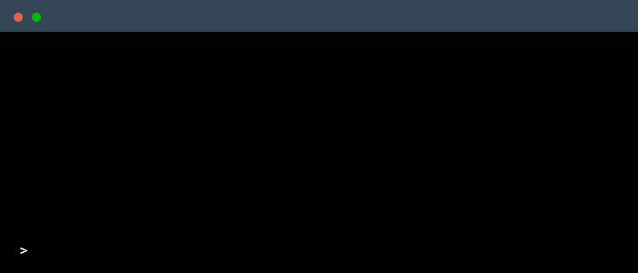

<!--
    Hey there, I'm Lohitha Kakumani!
    Thank you for exploring my GitHub profile.
    Feel free to explore and get inspired.
    Let's connect on LinkedIn @lohitha-kakumani :)
-->

 

  

### 🎯 My Mission
As a Computer Science undergraduate with a passion for solving real-world problems, I focus on building scalable and responsive web/mobile applications. I leverage my knowledge in full-stack development (MERN & Flutter) and data structures to tackle impactful challenges.Aiming for top-tier roles in tech companies.

---

### 🛠️ Core Technologies & Tools

---

### 📚 Currently Exploring

---

## 🚀 Projects  

- 🔹 **Knowledge Distillation – Intel Unnati Project**  
  *Implemented model compression techniques using Knowledge Distillation to optimize deep learning models for efficiency and scalability.*  
  `Status:` Completed  

- 🔹 **AgriConnect App**  
  *Flutter + Firebase mobile application empowering farmers to sell produce directly to consumers.*  
  `Status:` In Progress  

- 🔹 **E-Commerce Web Platform**  
  *A responsive MERN stack application with REST APIs, authentication, and cart management.*  
  `Impact:` Reduced payment errors by 20%, improved server response time by 25%.  

- 🔹 **ADAS – Automatic Alert Messages**  
  *Developing an Advanced Driver Assistance System (ADAS) to generate real-time alert messages for improved road safety.*  
  `Status:` Ongoing  

### 📊 GitHub Stats

---

### 📌 Connect with Me

    
    
    

---

<!-- ### 📝 Employer?

> 📄 [**Download My Resume**](https://drive.google.com/file/d/YOUR_RESUME_LINK_HERE/view?usp=sharing)

--- -->

     Thanks for scrolling all the way down :)

